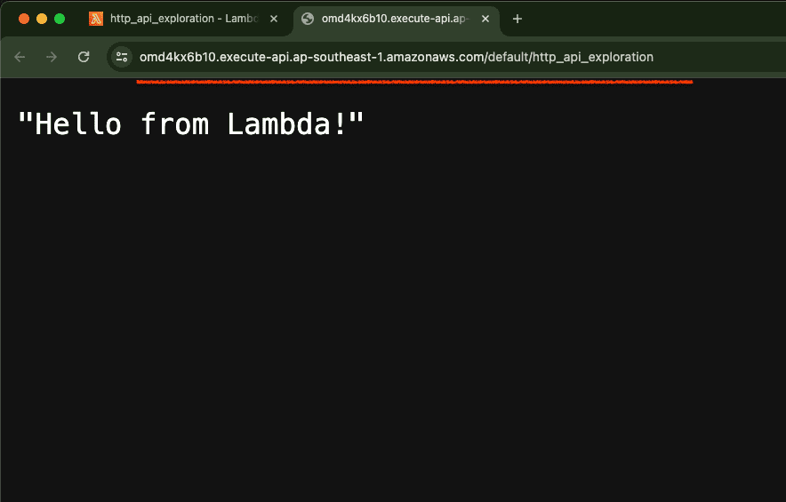
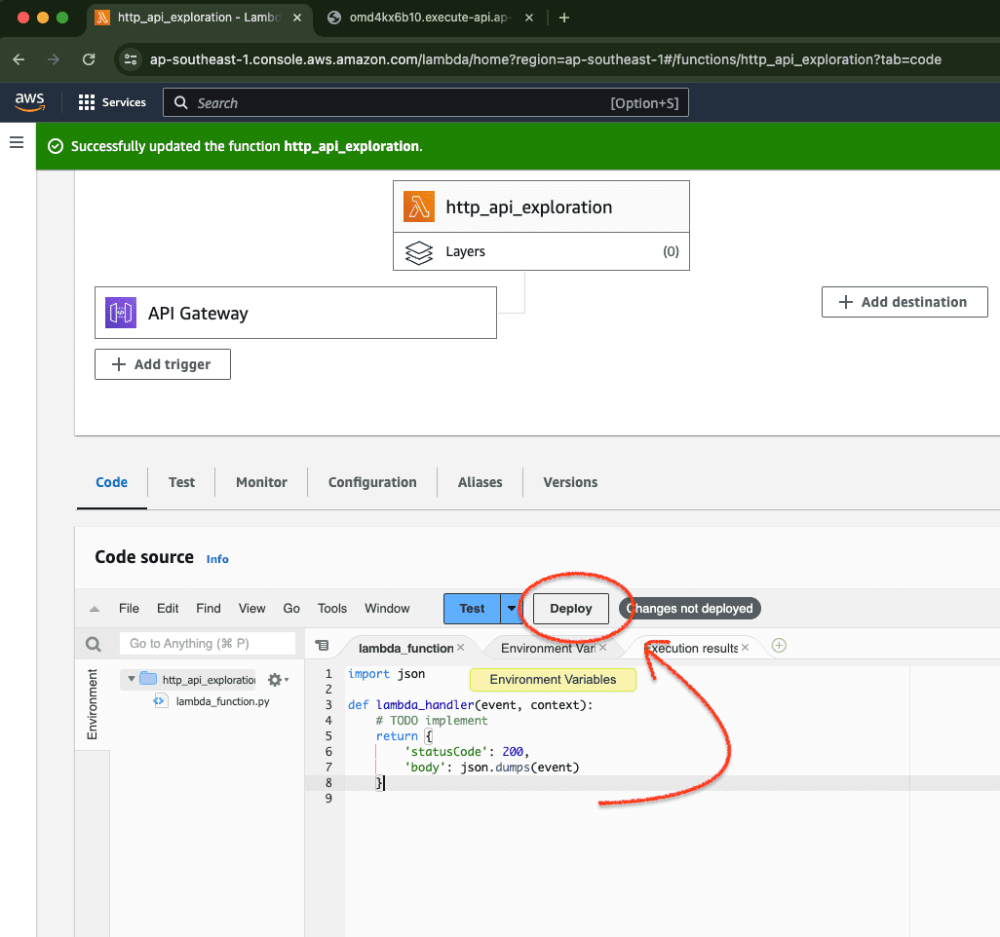
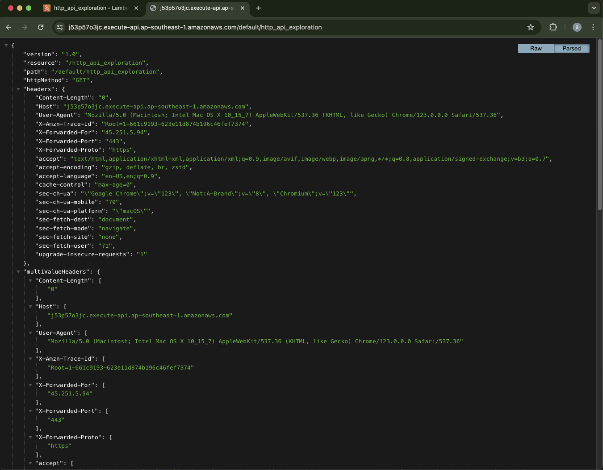
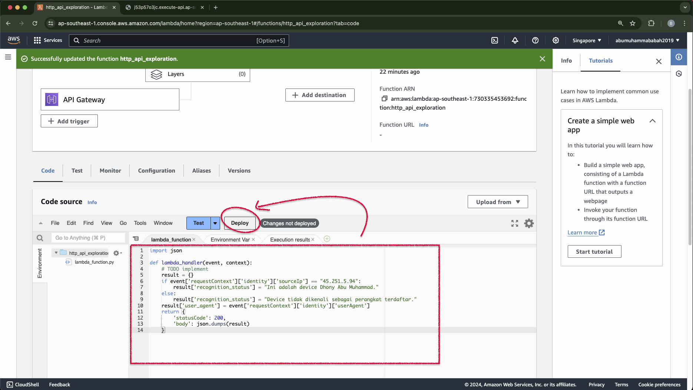
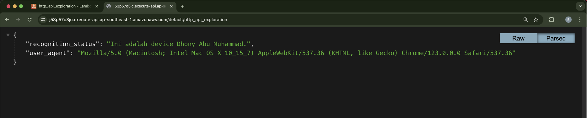
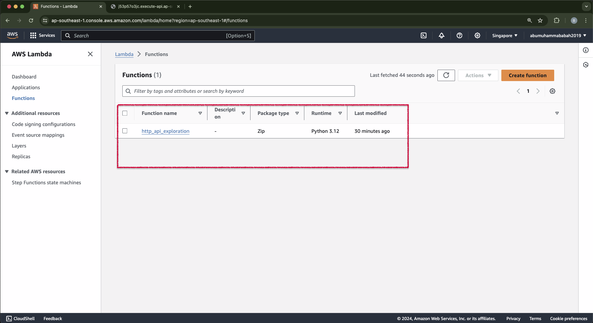

# &#x1F6A9; AWS Lambda Function | example API Gateway from scratch
**Function : http_api_exploration**

&nbsp;

Start by opening an AWS lambda service.

    

 

&nbsp;

Fill in the basic information for the service function that will be used.

    

 

&nbsp;

Define and script triggers in the service layer function.

    

 

&nbsp;

    

 

&nbsp;

    

 

&nbsp;

Tries to run the default script by triggering the predefined trigger.

    

 

&nbsp;

Make changes to the script to see the events obtained when activating the trigger.

    

 

&nbsp;

    

 

&nbsp;

Create custom scripts.

    

 

&nbsp;

<pre>
    import json

    def lambda_handler(event, context):
        # TODO implement
        result = {}
        if event['requestContext']['identity']['sourceIp'] == "45.251.5.94":
            result['recognition_status'] = "Ini adalah device Dhony Abu Muhammad."
        else:
            result['recognition_status'] = "Device tidak dikenali sebagai perangkat terdaftar."
        result['user_agent'] = event['requestContext']['identity']['userAgent']     
        return {
            'statusCode': 200,
            'body': json.dumps(result)
        }
</pre>

&nbsp;

&#x1F525; **Result :**

    

 

&nbsp;

&nbsp;

&nbsp;

---

&nbsp;

    

&nbsp;

---

&nbsp;

    

 

&nbsp;

---

&nbsp;

&nbsp;

    

 

&nbsp;

&nbsp;
