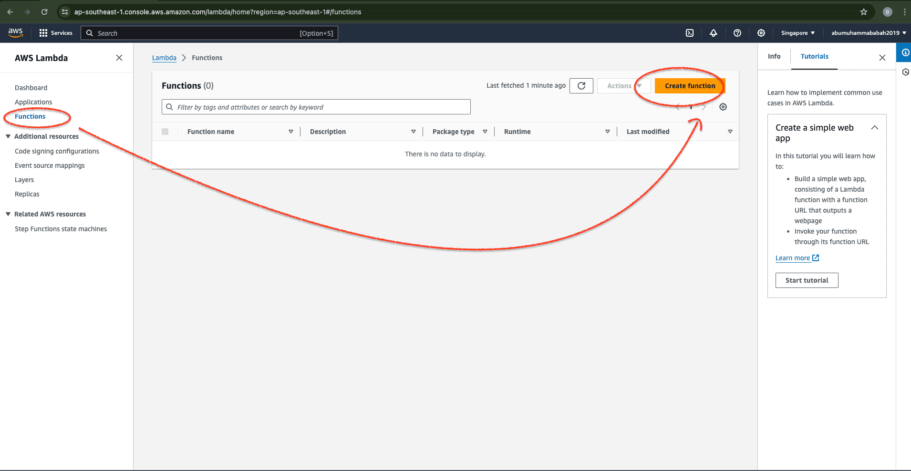
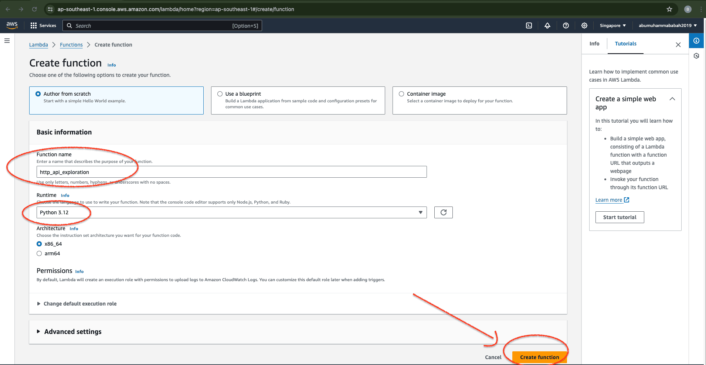
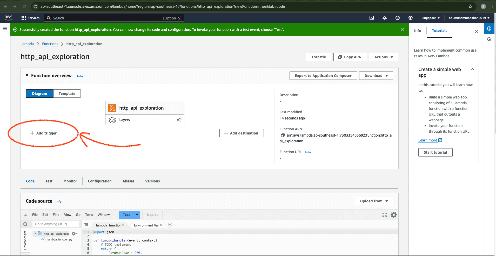
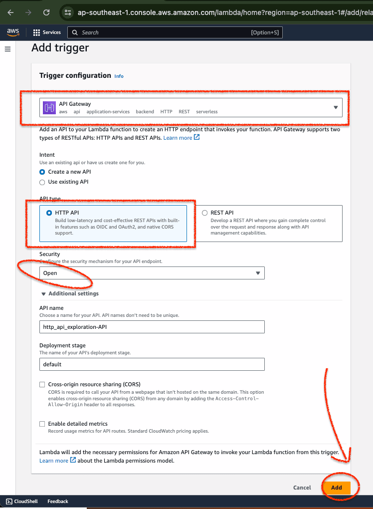
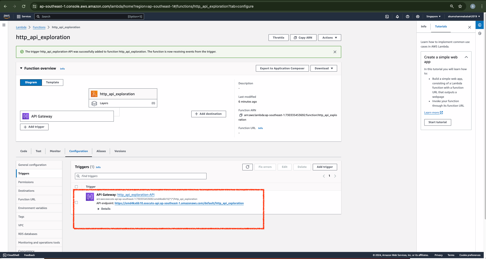

# &#x1F6A9; AWS Lambda Function | example API Gateway from scratch
**Function : http_api_exploration**

&nbsp;

Start by opening an AWS lambda service.

    

 

&nbsp;

Fill in the basic information for the service function that will be used.

    

 

&nbsp;

Define and script triggers in the service layer function.

    

 

&nbsp;

    

 

&nbsp;

    

 

&nbsp;

&nbsp;

---

&nbsp;